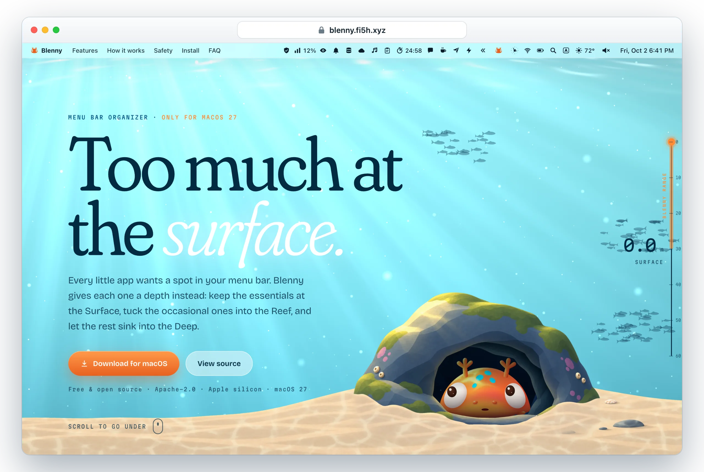
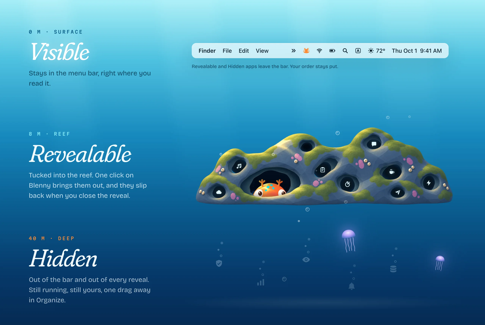
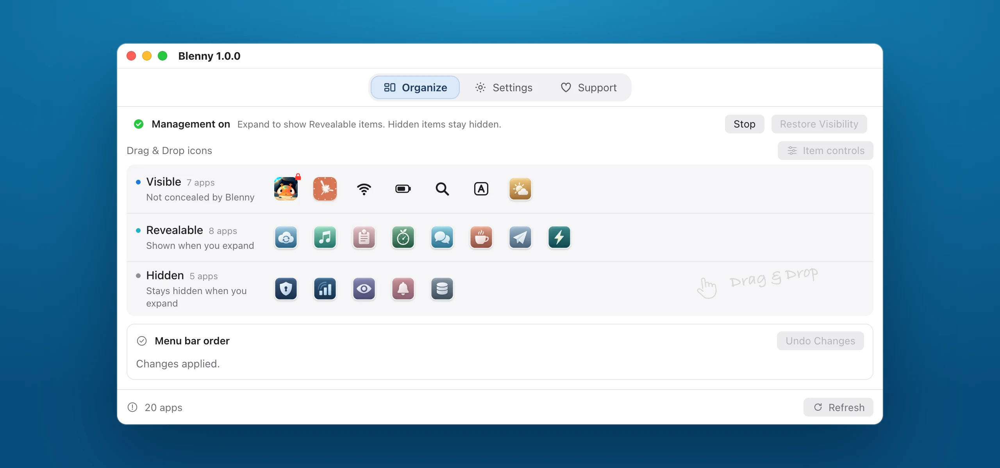

<p align="center">
  <a href="https://blenny.fi5h.xyz">
    
  </a>
</p>

<p align="center">
  <b>A menu bar organizer for macOS 27 that never touches your pointer.</b><br>
  A blenny is a small fish that lives in cracks in the reef and peeks out only when it has a reason to.<br>
  Blenny does the same for your menu bar.
</p>

<p align="center">
  <a href="https://blenny.fi5h.xyz"><b>Take the dive at blenny.fi5h.xyz →</b></a>
</p>

<p align="center">
  <a href="https://github.com/f-is-h/Blenny/releases/latest"></a>
  <a href="https://github.com/f-is-h/Blenny/releases"></a>
  <a href="https://blenny.fi5h.xyz"></a>
  <a href="https://github.com/sponsors/f-is-h?frequency=one-time&amp;metadata_project=blenny&amp;metadata_source=readme&amp;metadata_placement=badge&amp;metadata_lang=en"></a>
  <br>
  
  
  <a href="LICENSE"></a>
</p>

<p align="center">
  <a href="https://blenny.fi5h.xyz"><b>Website</b></a> ·
  <a href="#install">Install</a> ·
  <a href="#organize">Organize</a> ·
  <a href="#known-limitations">Known limitations</a> ·
  <a href="#build-from-source">Build from source</a> ·
  <a href="https://github.com/f-is-h/Blenny/releases">Release notes</a>
</p>

<br>

## Every app gets a depth

Blenny gives every menu bar app one of three depths, and you decide which.



Policy follows the owning application, so an app with several icons moves as
one. Hidden apps keep running; they just stop asking for attention, and you can
bring them back from Organize at any time. macOS still controls its own
overflow, so a Visible app may overflow when space is tight.

> **Field note · 3 – 20 m.** A blenny claims one hole and defends it. Most of
> the time you only see its head, watching the water.

## Gentle with your Mac

<table>
  <tr>
    <td width="33%" valign="top">
      <h3>⌖&nbsp; Hands off your pointer</h3>
      Blenny never moves the cursor, clicks for you or fakes a Command‑drag.
    </td>
    <td width="33%" valign="top">
      <h3>◐&nbsp; No Screen Recording</h3>
      Blenny doesn't watch your screen, so it never asks for Screen Recording permission. No background polling either.
    </td>
    <td width="33%" valign="top">
      <h3>⇣&nbsp; One careful writer</h3>
      Every change runs through a single queue with a saved recovery record, one verification and at most one retry.
    </td>
  </tr>
  <tr>
    <td width="33%" valign="top">
      <h3>◼︎&nbsp; Fails closed</h3>
      If the menu bar changed under it, Blenny stops and asks instead of writing again.
    </td>
    <td width="33%" valign="top">
      <h3>↺&nbsp; Recoverable</h3>
      Interrupted changes keep a recovery record, so Recover Changes can finish or restore them.
    </td>
    <td width="33%" valign="top">
      <h3>✦&nbsp; Signed updates</h3>
      Updates arrive through Sparkle, checked against Blenny's own key. Automatic checks stay off until you turn them on.
    </td>
  </tr>
</table>

Blenny is a native AppKit and SwiftUI app of about 6 MB, built only for macOS 27, with Sparkle as its only bundled dependency.

## Organize

<p align="center"></p>
<p align="center"><sub>The Organize window as recreated on the website, populated with invented apps.</sub></p>

**Draft, then Apply.** Drag icons between Visible, Revealable and Hidden and
into the order you want, or use an icon's context menu or accessibility
actions. Nothing touches your menu bar until you choose **Apply**;
**Discard Changes** returns to your accepted setup.

| Control | What it does |
| --- | --- |
| **Undo Changes** | Reverses the latest successful Apply, visibility and order together. Undo has one level; if another change invalidates its baseline, Blenny asks you to review **Replace Undo & Apply** first. |
| **Stop** | Releases visibility restrictions immediately and keeps your order. |
| **Resume** | Revalidates and reapplies your saved configuration. |
| **Quit** | Releases restrictions and remembers your Resume choice for the next launch. |
| **Position Blenny Controls…** | Places Blenny's arrow and fish at the boundary between Revealable and Visible. **Undo Control Placement** restores their previous positions on its own. |

## Install

1. Download `Blenny-<version>.dmg` from
   [**GitHub Releases**](https://github.com/f-is-h/Blenny/releases/latest), open
   it and drag Blenny into **Applications**. Quit any older copy first, then eject
   the disk image and launch the installed copy.
2. Grant **Device Control** when Blenny asks. If it asks for ordering access,
   choose the exact **Menu Bar Layout File** shown in its file picker.
   Screen Recording is not required.
3. Keep the apps you want to manage in `/Applications`, and relaunch an app
   after moving it there.

<details>
<summary><b>macOS says Blenny can't be opened?</b></summary>
<br>

Blenny uses a fixed self-signed certificate and is not notarized by Apple. Try
to open it once, then choose **System Settings → Privacy & Security → Open
Anyway** ([Apple's instructions](https://support.apple.com/102445)). You do not
need to disable Gatekeeper or SIP, or install a trusted root certificate.

</details>

<details>
<summary><b>Verifying the download</b></summary>
<br>

Each release ships `Blenny-<version>.dmg.sha256` next to the disk image, and a
receipt recording the source commit, build and signature. Public binaries are
built on GitHub from the reviewed, tagged source. Tested environments are
listed in the [acceptance record](docs/ACCEPTANCE_1.0.0.md).

</details>

## Known limitations

These come from how macOS 27 treats menu bar items while management is active,
not from missing permissions. Each has a workaround or a safe fallback. Please
read them before you install.

| Area | What happens | Workaround |
| --- | --- | --- |
| Clock / Notification Center | Clicking the native Clock does not open Notification Center while management is active. | Swipe left from the right edge of the trackpad, or Stop management. |
| Now Playing | Can disappear during management, although Blenny writes no new settings for it. Blenny offers recovery only. | Stop management to release the restriction. |
| Gaming, Wine and other unattributed extras | Menu extras whose host has no application Bundle ID may disappear. An Organize entry does not prove the icon is physically visible. | Stop or Quit Blenny to release the restriction. |
| Application location | Apps run from development folders, the Desktop or `~/Applications` can lose their menu bar identity and be hidden. Full Disk Access does not fix this. | Install managed apps in `/Applications` and relaunch them after moving. |
| System item sorting | Siri, Time Machine and Control Center cannot be sorted yet. Clock and the native overflow arrow stay fixed. | Their visibility can still be managed where supported. |
| Exact placement | Pixel positions and adjacency between Blenny's controls and the native overflow arrow are not guaranteed. | Preferred positions keep relative order. |
| Displays | Multiple displays have not been tested. | Report what you see in an issue. |

> [!TIP]
> **Help wanted.** These are open problems. If you know macOS 27's menu bar
> internals or find a route that works, open an
> [issue](https://github.com/f-is-h/Blenny/issues) with your evidence or send a
> pull request. [KNOWN_LIMITATIONS.md](docs/KNOWN_LIMITATIONS.md) records what
> has already been tried and why it failed.
>
> A fix must keep Blenny's core promises: no pointer movement, synthesized clicks
> or simulated drags, no private entitlements or SIP changes, no Screen Recording
> requirement, no polling loops, and complete restoration of any system state it
> changes. Automatically stopping and resuming management around a click is not
> an accepted fix, because it releases hiding restrictions.

## Updates and recovery

Use **Check for Updates** in Settings or Blenny's menu. **Automatic checks** can
be enabled in Settings and are off by default; they never install unattended.
Finish any running operation, resolve pending recovery, and apply or discard
your draft before updating. Every update is verified against Blenny's own
EdDSA key.

> [!IMPORTANT]
> If Blenny reports an unfinished change, use **Recover Changes** and keep its
> recovery data until it completes. Do not delete recovery files to dismiss an
> error. [Recovery and uninstall](docs/RECOVERY_AND_UNINSTALL.md) explains what
> Stop, Undo and recovery restore, how to handle lost access, and how to remove
> Blenny cleanly.

## Build from source

Use Xcode 27 and the macOS 27 SDK explicitly:

```sh
DEVELOPER_DIR=/Applications/Xcode.app/Contents/Developer ./scripts/verify-local.sh
DEVELOPER_DIR=/Applications/Xcode.app/Contents/Developer ./scripts/build-app.sh debug
```

Debug and ordinary Release share the daily product capabilities; Debug adds
development menus and bounded probes. Distribution builds require the owner's
pinned certificate. Contributors can request a development ad-hoc build with
`BLENNY_CODE_SIGN_IDENTITY=- BLENNY_ALLOW_ADHOC=YES`; it is not eligible for
distribution or authenticated updates.

More reading: [contributing](CONTRIBUTING.md), [product contract](PROJECT_BRIEF.md),
[roadmap](docs/ROADMAP.md), [release procedure](docs/DISTRIBUTION.md),
[changelog](CHANGELOG.md) and [archived research](Research/README.md). Report
reproducible problems through [GitHub Issues](https://github.com/f-is-h/Blenny/issues),
leaving out raw menu bar inventories, credentials and personal paths.

<br>

<p align="center">
  
</p>

<p align="center">
  <a href="https://blenny.fi5h.xyz"><b>blenny.fi5h.xyz</b></a>
</p>

<p align="center">
  If Blenny keeps your menu bar a little quieter, you can support it through<br>
  <a href="https://github.com/sponsors/f-is-h?frequency=one-time&amp;metadata_project=blenny&amp;metadata_source=readme&amp;metadata_placement=badge&amp;metadata_lang=en">GitHub Sponsors</a>
  or <a href="https://ko-fi.com/blenny">Ko-fi</a>.
</p>

<p align="center">
  <sub>Licensed under <a href="LICENSE">Apache-2.0</a> · <a href="NOTICE">NOTICE</a> · <a href="THIRD_PARTY_NOTICES.txt">Third-party notices</a> · Sparkle is the bundled update dependency.</sub>
</p>
