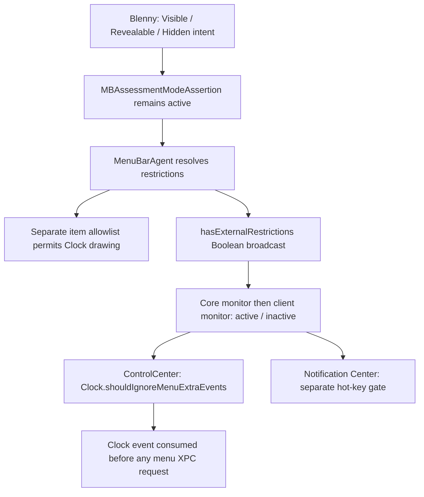

# Why visibility management blocks the native Clock action

Status: **Final 0.9.0 investigation completed without a compatible repair.**
Scope: macOS 27.0 build `26A5425a`, arm64e. This report combines current-source
inspection, static analysis of the installed Apple binaries, read-only symbol
resolution in an independent process, and the owner's Stop/Resume and trackpad tests.
No new live hide/order experiment was performed. The
[investigation record](NOTIFICATION_CENTER_RESEARCH_2026-09-12.md) preserves the
earlier searches; [Known limitations](KNOWN_LIMITATIONS.md) describes user impact.

## Causal conclusion

Blenny's current backend requests an assessment-origin **visibility restriction**.
The system independently resolves which items may be shown and whether an
external restriction exists. MenuBarAgent broadcasts the latter Boolean.
ControlCenter consumes it and makes its Clock ignore menu-extra events before
sending a request to Notification Center. Allowing Clock to remain visible does
not exempt it from that event restriction.

This corrects an earlier attribution: the Clock does **not** call
`hotKeyRequestCenterOpenOnDisplay:`. Clock uses `NCNotificationCenterMenu` and
`ncMenuMouseDown` / `ncMenuMouseUp`; the hot-key gate is a parallel consumer.
The actual Clock interception happens earlier, inside ControlCenter.

This is a compatibility conflict in the chosen hiding backend, not a stale
ordering snapshot, a missing permission, or a rendering delay. The owner's
finding that Stop restores Clock interaction while preserving accepted ordering
is consistent with the separate mechanisms traced below.

## From the assertion to the exact broadcast flag

Blenny constructs `MBAssessmentModeConfiguration` with bundle and numbered-item
allowlists, verifies their round trip, and activates an
`MBAssessmentModeAssertion` through the existing serial writer. See
[the runtime adapter](../Sources/BlennyCore/MacOS27/ExperimentalAssessmentRuntime.swift)
and [the assertion writer](../Sources/BlennyCore/MacOS27/RevealAssertionWriter.swift).

MenuBarAgent's `ResolveRestrictionsStep.Output` has five Boolean fields followed
by a separate assessment allowlist. Its external-restriction helper returns true
when any restriction has an origin other than internal `campoDrag`.
`hasAnyRestriction` separately tests whether the restriction collection is
nonempty. Neither calculation consults the allowlist.

The final audit follows `hasExternalRestrictions` into field 7 of
`ElementPlacementResolverComponent.Output`, then into the
`notifyVisibilityRestrictionsDidChange(Swift.Bool)` action. The action dispatches
through `MBEnvironment.visibilityRestrictionServer` to the broadcaster, which
boxes the Boolean in one `NSNumber` and sends it to its client connections.
This closes the previously missing producer link: the broadcast carries
**`hasExternalRestrictions`, not `hasAnyRestriction`**. It carries no bundle name,
system-item identity or visibility allowlist.

The server also schedules an initial value for each accepted, configured client,
using whether its separately maintained `activeAssertionIDs` set is nonempty.
That set follows XPC assertion acquire/release bookkeeping; it is not a cached
graph Output field. This audit does not prove equivalence of initial and later
broadcast values across every race or failed lifecycle transition. The earlier
passive observer's timeout establishes only that no callback was observed; it
does not establish that the server has no initial-state delivery.

The external origin decoder accepts assessment and user-session transition.
Both are external for this calculation. It rejects the internal `campoDrag`
origin. Changing allowlists or selecting the other accepted origin therefore
does not remove the signal responsible for Clock suppression.

## From the broadcast to Clock's consumed event

`MenuBarClientCore.VisibilityRestrictionMonitorSession` receives
`visibilityRestrictionsDidChange(NSNumber)`, serializes it and compares the
number to zero. Zero becomes `.inactive`; nonzero becomes `.active`.
`MenuBarClient.VisibilityRestrictionMonitor` owns this session, activates it on
`startMonitoring`, and forwards the corresponding state to its delegate.
The inspected enum descriptors in both frameworks encode inactive as `0` and
active as `1`.

ControlCenter starts this monitor. Its callback compares the delivered state to
`.active`, then stores the result in `ControlCenter.shouldIgnoreHotKeys` and
`Clock.shouldIgnoreMenuExtraEvents`. The Clock event handler tests the second
flag. If true, it takes a direct branch to a consumed-event return before looking
up the remote menu client. **No menu XPC request occurs on this branch.** There
is no remote error or timeout for Blenny to catch, wait for, or retry.

When the flag is false, the handler sends `ncMenuMouseDown` / `ncMenuMouseUp`
through `com.apple.notificationcenterui.menu`. `NCMenuConnection` forwards those
selectors to MainController's menu path, which reaches the common panel-opening
routine without calling the hot-key gate. Matching service, protocol, selectors
and receiver implementations establish this cross-process relationship
statically; no live XPC transaction was captured.

The actual menu-service listener requires
`com.apple.private.notificationcenter.menu` to be a true `NSNumber` entitlement
on the incoming connection. Missing, false or incorrectly typed values cause
invalidation and rejection. The installed ControlCenter signature carries that
entitlement. Blenny cannot use this protected service as an ordinary alternate
entry; it would not repair Clock's earlier local event suppression either.

A brief highlight without a panel is consistent with local pressed feedback
followed by that consumed return. The highlight-drawing implementation itself
was not traced. The direct early return, rather than that visual inference, is
the decisive evidence.

## Why visible Clock, ordinary Reveal and Stop differ

Clock is numbered system item `2` in the inspected runtime.
[The allowlist planner](../Sources/BlennyCore/RevealablePolicy.swift) begins with
all known numbered items and removes only mutable managed items. Clock is not
offered as mutable policy, so it stays admitted in both baseline and ordinary
Reveal configurations. Drawing eligibility and event eligibility are different
checks in different parts of the system.

`RevealAssertionWriter.replace` activates the replacement before invalidating
the preceding assertion. This deliberate overlap prevents a gap that could
expose Hidden owners. Ordinary Reveal changes the admitted application set while
retaining an active assertion; it does not make the aggregate flag inactive.
Longer waits, a larger allowlist or different order values cannot change that.

`restoreAndStop` invalidates Blenny's pending and current assertions. When no
other external restriction remains, the system can publish inactive and
ControlCenter permits Clock's native request again. This agrees with the
owner's recovery without quitting Blenny or restoring accepted order. Temporarily
releasing the assertion around a click could expose Revealable **and Hidden**
owners; it would change concealment semantics rather than repair this backend.

## What the evidence does and does not say about Notification Center

NotificationCenter separately monitors the same state and gates its
`hotKeyRequestCenterOpenOnDisplay:` path. That does not mean every panel-opening
path uses the same gate. The inspected Dock toggle reaches the common open/close
routine without this local check, but its listener requires
`com.apple.private.notificationcenter`. It is not an ordinary application API.

The owner subsequently confirms that swiping left from the trackpad right edge
opens Notification Center while management remains active and Clock clicks fail.
This is direct owner-operated evidence that panel presentation remains functional
through another entry on the tested setup. It supersedes the earlier unverified
status of the trackpad workaround.

System-gesture registration and a gesture-disabling path exist, but the audit
did not establish that this restriction callback drives that path or complete
the gesture-to-open chain. The successful gesture does not by itself prove its
exact internal route. Notification delivery, every entry and other hardware or
macOS builds remain outside the demonstrated result.

Apple's [Automatic Assessment Configuration documentation](https://developer.apple.com/documentation/automaticassessmentconfiguration)
lists Notification Center among the surfaces assessment sessions restrict.
[WWDC26 session 230](https://developer.apple.com/videos/play/wwdc2026/230/)
separately demonstrates permitting selected menu-bar items, including Clock.
This supplies design context for separating time display from access to
notification content. Blenny does not start a public `AEAssessmentSession`;
these public documents do not prove that its lower-level private assertion
activates all exam-mode restrictions.

## Final alternative: stored visibility is not a live foreign-item setter

The final AppKit audit examined `NSStatusItem` visibility persistence beyond its
documented existence. The owner-side setter stores either
`NSStatusItem VisibleCC <autosaveName>` in scene mode or
`NSStatusItem Visible <autosaveName>` outside scene mode. Scene mode removes the
legacy key. It uses the owner's `standardUserDefaults`, updates the local object,
and propagates scene settings.

`_restorePreferencesFromAutosaveName` reads those values and applies them to the
owning object. The bounded AppKit direct-call scan found restoration through
`setAutosaveName:` during initialization, and a separate host-side scene update.
The latter is not a foreign defaults reader: `NSSceneHostingStatusItem` overrides
both visibility-key getters to return `nil`, then mirrors client scene settings
into its local item. No defaults-change observer or live external-preference
adoption trigger was found in this path.

The actual live sequence is:

1. The owner's `NSSceneStatusItem.setVisible` updates client scene settings.
2. `NSStatusItemHost` receives the diff and changes `clientRequestsVisibility`.
3. `NSStatusBar` observes that host property and updates its local status item.

That KVO observer watches the host object, not the owner's defaults. An external
preference edit may be consumed at the next owner initialization or autosave-name
reset, but writing stored bytes does not call the owner's setter or generate the
required scene diff. The owner's later setter can also overwrite the stored
value. Live adoption, sandbox-domain selection, multi-item identity and exact
inverse across owner recreation remain unverified for external edits.

An earlier isolated preference-notification probe showed that cross-process
UserDefaults KVO can work **when a consumer explicitly subscribes**. Only its
source and saved result were read this round; it was not rerun. Notification
transport alone cannot supply the missing subscription in the inspected item
implementation. This is a bounded static finding, not proof that no future
AppKit version or application-specific implementation can support it.

## Disposition of the remaining approaches

| Approach | Reason it does not repair the current product contract |
| --- | --- |
| Add Clock, host or Notification Center to the allowlist | Clock is already allowed; the broadcast flag is computed separately. |
| Restrict only Hidden owners or use a pass-through allowlist | An external restriction still exists. |
| Change origin | Both accepted external origins activate the flag; internal drag is rejected. |
| Register or hide items through the item-manager XPC channel | Inspected operations use the authenticated caller connection, not an arbitrary foreign owner. |
| Change saved `NSStatusItem Visible*` values | No live external adoption path found; stored readback does not prove presentation or lifecycle recovery. |
| Use preferred positions, a spacer or native overflow | Relative order and available width do not enforce independent Revealable and Hidden exclusion sets. |
| Use exact Apple-item preferences | Existing adapters cover selected system items, not general third-party bundles. |
| Open Notification Center through another service | Both the native menu endpoint and inspected Dock alternative require private entitlements. No permitted callable replacement was established; a separate entry would not restore the native Clock handler. |
| Release and reacquire hiding around a click | Explicitly rejected by the owner; it could expose Hidden owners and will not be implemented. |

## Reproducible anchors

These are build-specific inspection anchors, not callable product contracts or
addresses to patch. Executable addresses below are unslid virtual addresses;
framework addresses use the inspected shared-cache virtual layout. AppKit values
are image-relative offsets. Raw disassembly and local inventories remain ignored.

| Image | UUID |
| --- | --- |
| MenuBarAgent | `DE3CDABA-05ED-328C-88BE-41D240550156` |
| MenuBarClientCore | `CA5DE7FC-32E9-327F-BC2E-BF44B4035141` |
| MenuBarClient | `6CED7FB8-A2C7-3BF3-A9F4-EA4FEC1C199B` |
| ControlCenter | `E842FC2A-0AAB-350D-BEA6-66229257C329` |
| NotificationCenter | `D0CFEB98-2A67-3BB6-959C-8028756DB7FF` |
| AppKit | `4B249BE2-4C3A-31BC-B235-234F73414863` |

| Link | Static anchors |
| --- | --- |
| External flag calculation | MenuBarAgent resolver `0x1000117A8`; external helper `0x100011D90`; packed fields `0x100011D2C`–`0x100011D58`; separate allowlist fold `0x100012028` |
| Flag selected for broadcast | Output field 7 populated at `0x100018714`–`0x100018720`; action created at `0x1002C9254`–`0x1002C9278`; enum case `0x10` dispatch at `0x1002FCA08` |
| Server dispatch | Environment visibility server at `+0x188`; witness table `0x10041A168`, slot `+0x30` to `0x10034F880`, then `0x10034CA4C`; boxed broadcast `0x10034CAC4`; client selector send `0x10034F2A8` |
| Initial client state | Acceptance `0x10034C8C4`; initial callback scheduled at `0x10034CA08`–`0x10034CA24`; closure `0x10034FDDC` reads `State.activeAssertionIDs` count; delivery `0x10034D2C4` |
| Core conversion | Callback `0x2624ECD04`; serialized helper `0x2624B3A48`; NSNumber zero comparison `0x2624B3B54`–`0x2624B3B68`; nonzero-to-active computation `0x2624B3B78`–`0x2624B3B80` |
| Client forwarding | Session initialization `0x262495438`; start `0x2624959CC`; state forwarding `0x262495950`–`0x2624959A4` |
| ControlCenter restriction callback | Monitor setup `0x1001B04E4`–`0x1001B06C4`; active comparisons and Clock flag write `0x1001B2130`–`0x1001B2218` |
| Clock suppression | Handler `0x100210704`; flag load `0x1002107E4`–`0x1002107EC`; branch `0x1002107F0`; consumed return `0x100210828` |
| Clock field identity | Nominal descriptor `0x10079CDF8`; field descriptor `0x1007DA054`; second record names `shouldIgnoreMenuExtraEvents`; initializer `0x100210E4C`–`0x100210E54` uses the same ivar-offset variable `0x10095F4F0` |
| Clock menu receiver | `NCMenuConnection.ncMenuMouseDown` `0x100008590`; MainController entry `0x100172D7C`; common-open call `0x100172D48` to `0x1001BF85C` |
| Menu-service entitlement | Listener setup `0x10000833C`; entitlement query `0x1000083EC`–`0x1000083F4`; NSNumber/true checks `0x100008400`–`0x100008428`; rejection/invalidation `0x1000084C0` |
| Separate hot-key gate | Thunk `0x100172FAC`; gate `0x100172F50`; restricted return `0x100172F6C`; restriction callback `0x1001766FC`–`0x100176754` |
| AppKit preference restoration | `_restorePreferencesFromAutosaveName` `+0x24A06C`; direct calls `+0x249EF4` and `+0x5412D4`; setter storage `+0x8AA180` |
| AppKit live visibility | Scene setter `+0x673F98`; scene-settings diff `+0xF99B50`–`+0xF99CB0`; host KVO registration `+0x89C650`–`+0x89C668`; local setter call `+0x89C8F8`–`+0x89C904` |

The producer trace uses Swift field reflection and enum-case descriptors to
identify fields and actions, plus the witness-table fixup to identify the server.
The framework bridge was checked by resolving stubs and reading enum descriptors
in a separate process's own mapped memory. Pointer authentication was stripped
only for symbol inspection; no other process was attached or modified.

## Validation limits and stopping point

This round compiled the read-only inspection helper with Xcode 27 and the macOS
27 SDK. It did not create an assertion, call a remote service, write preferences,
restart a process, synthesize input, install an application or change product
behavior. Prior automated fixture results are not a new native-interaction test.
The owner's Clock/Stop and successful managed-state trackpad tests are dynamic evidence;
the producer, monitor conversion and Clock branch are direct static evidence.

No compatible repair or replacement hiding backend was established. For 0.9.0,
stop parameter and delay experiments for this issue and retain its explicit
limitation and owner-verified trackpad alternative. This follows the owner's earlier
fallback decision; it does not discard the version or its existing work.
Version closure and the pending public-source discussion remain separate.

Reopening requires new evidence of an API that separates selective hiding from
the interaction restriction, a proved live cross-owner visibility contract. Automatic temporary suspension
is explicitly excluded by the owner. A candidate must then
pass native Clock interaction during management, ordinary reveal/conceal,
policy/order Apply and Stop/Resume, plus failure and exact recovery checks through
the sole writer. Hidden owners must remain excluded from ordinary Reveal.
No release gate, runtime boundary or experiment-authorization requirement is waived.
